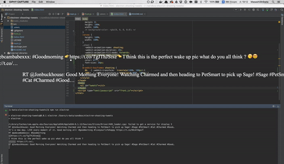

# electron-shooting-tweets
Shooting tweets timeline for Desktop.



## How to work

Set environment variables:

```
export HASHTAG=#GoodMorning
export TWITTER_CONSUMER_KEY=XXXXXXXXXXXXXXXXXXXXXXXXX
export TWITTER_CONSUMER_SECRET=XXXXXXXXXXXXXXXXXXXXXXXXXXXXXXXXXXXXXXXXXXXXXXXXXX
export TWITTER_ACCESS_TOKEN_KEY=XXXXXXXXXXXXXXXXXXXXXXXXXXXXXXXXXXXXXXXXXXXXXXXXXX
export TWITTER_ACCESS_TOKEN_SECRET=XXXXXXXXXXXXXXXXXXXXXXXXXXXXXXXXXXXXXXXXXXXXX
```

And run:

```
$ npm install
$ npm run electron
```
